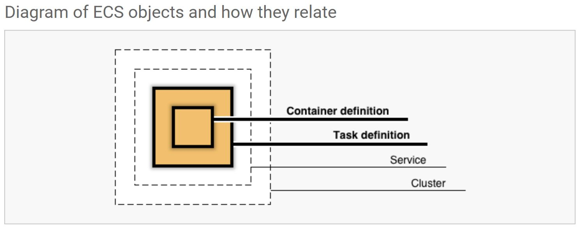

This repository is made for the blogpost on https://blog.oio.de/.

In this blogpost we take a look on how you can use multiple-provider when applying [`terraform`][1] as tool of choice for the infrastructure, as it proclaims to be [provider-independent][10].

## Which way to go

This post is not intended to align strictly with any good or best practices,
rather it is just the extended documentation of the test on how easy it is to use Terraform as a multi-cloud-provider tool
with only basic background-knowledge.

There are myriad of ways to get your Java application running on one of the cloud providers platform's, just to mention a few here, if you want to dig deeper into the specific possibilities.

Following only some services of Azure and AWS are mentioned, though the other big providers offer similar services.

- deploy as a FaaS (FunctionAsAService)
  - [AWS Lambda][4]
  - [Azure Functions][5]
- deploy as a Container (rather PlatformAsAService approach)
  - using the provider's registry-services
    - [AWS Elastic Container Registry][6]
    - [Azure Container Registry][7]
  - [AWS Elastic Container Service][8]
  - [Azure Container Instances][9]

One example on how to deploy a containerized Java Application on Azure you can find [in the previous blog-post by Oliver][2] and an even more automated version [here][23].

Now how easy is it to use multiple provider, when we do not want to focus on just one of them?

We will use the [Container Registry Service][7] from **Azure** as a repository for our docker images,
which we will build from our basic Java Spring-Boot application. For the deployment we will provision the [AWS Elastic Container Service][8] to run our image on **AWS**.

## Prerequisites

To follow along a tutorial which involves provision infrastructure on one of the cloud-provider's platforms often involves some _up-front_ effort to get rolling.

- Get a free [AWS-Account][13]
- Get a free [Azure-Account][14]
- Install [Terraform][12]
- Install [Azure-CLI][11]
- Install [Docker for Windows][24] (depending on your OS, [choose the installation method wisely][25])

> Please be warned, that you have to register at the cloud providers with a credit card. Though all the services we are using, should be free of charge in the first 12 month.

## First things first ...

If you already followed along [Oliver's][18] previous blog posts on [how to run a containerized Java application on Azure][15] and [how to re-deploy such an application][16], you have a good base for the upcoming steps, since we will be using the same approach, building a docker-image from a basic Java Spring-Boot application, pushing the image to our container registry in Azure later on, all automatized by the mentioned [gradle-plugin named jib][26].

So we could use the gradle-plugin as follows in the `build.gradle` of the project

```groovy
jib {
    from {
        image = 'adoptopenjdk:11-jre'
    }
    to {
        image = 'repository/image'
        tags = ['0.1']
    }
    container {
        ports = ['8080']
        creationTime = 'USE_CURRENT_TIMESTAMP'
    }
}
tasks.build.dependsOn tasks.jib
```

This would create an image with the latest-tag as default and an additional image with the tag `0.1`. The port should be remembered since we have to use it later on in the configuration of the container service in AWS.

Before we now can build and push our image with `./gradlew build` to the registy in Azure, we should first create it.

## ... building the infrastructure with Terraform

With Terraform multiple providers can be used as plugins to enable the communication between the tool `terraform` and those providers, like AWS, Azure, Google Cloud Platform, Alibaba Cloud and [many more][17].

To start with terraform we could create a directory next to our application-directory, which e.g. is called `infrastructure`
and create a file there named `main.tf` for our infrastructure-code.

For provisioning two different services from two different providers - like AWS and Azure in our case -
we first have to declare the providers in provider blocks. Additionally the versions for the providers can be specified in `required_providers`-block within the basic `terraform`-block. So we would have following configuration as a start.

**main.tf**

```ruby
terraform {
  required_providers {
    aws = {
      source  = "hashicorp/aws"
      version = "~> 3.27"
    }
    azurerm = {
      source  = "hashicorp/azurerm"
      version = "=2.46.0"
    }
  }
  required_version = ">= 0.14.9"
}

# Configure AWS Provider
provider "aws" {
  profile = "default"
  region  = "us-east-1"
}

# Configure Microsoft Azure Provider
provider "azurerm" {
  features {}
}
```

So far so good, now let's continue with configuring the container registry in Azure for our image, to resite in.
Therefore we have to connect our local Azure-CLI-tool to our Azure-account, which we can achieve with the installed Azure-CLI. There definitely might [be other and more robust ways for different purposes][27] to authenticate with Terraform at Azure. For the sake of simplicity we will use the CLI here.

```bash
az login
```

Now let's add the code to build the container registry at Azure. To see more of the respective documentation take a look [here][28].

```ruby
resource "azurerm_resource_group" "rg" {
  name     = "terraform-container-registry"
  location = "West Europe"
}

resource "azurerm_container_registry" "acr" {
  name                     = "acr4711"
  resource_group_name      = azurerm_resource_group.rg.name
  location                 = azurerm_resource_group.rg.location
  sku                      = "Standard"
  admin_enabled            = true
}
```

Within one `resource`-block in HCL (HashiCorp Configuration Language) we can reference other resources and their attributes.
All the available attributes, that can be referenced, can be found in the documentation, as well.

Now that we have poured our infrastructure for the registry into code, let's continue with the components we need on AWS, which seems to be a little bit more.

First we need to configure the respective network-components, which are needed later one, to reach our running container from the internet. The network configuration consists of a VPC (Virtual Private Network), a Subnet, Security Groups and Load Balancers.

```ruby
## Configure networking
data "aws_vpc" "default" {
  default = true
}

data "aws_subnet_ids" "default" {
  vpc_id = "${data.aws_vpc.default.id}"
}

resource "aws_security_group" "lb" {
  name        = "lb-sg"
  description = "controls access to the Application Load Balancer (ALB)"

  ingress {
    protocol    = "tcp"
    from_port   = 80
    to_port     = 80
    cidr_blocks = ["0.0.0.0/0"]
  }

  egress {
    protocol    = "-1"
    from_port   = 0
    to_port     = 0
    cidr_blocks = ["0.0.0.0/0"]
  }
}

resource "aws_security_group" "ecs_tasks" {
  name        = "ecs-tasks-sg"
  description = "allow inbound access from the ALB only"

  ingress {
    protocol        = "tcp"
    from_port       = 8080
    to_port         = 8080
    cidr_blocks     = ["0.0.0.0/0"]
    security_groups = [aws_security_group.lb.id]
  }

  egress {
    protocol    = "-1"
    from_port   = 0
    to_port     = 0
    cidr_blocks = ["0.0.0.0/0"]
  }
}

resource "aws_lb" "staging" {
  name               = "alb"
  subnets            = data.aws_subnet_ids.default.ids
  load_balancer_type = "application"
  security_groups    = [aws_security_group.lb.id]
}

resource "aws_lb_listener" "https_forward" {
  load_balancer_arn = aws_lb.staging.arn
  port              = 80
  protocol          = "HTTP"

  default_action {
    type             = "forward"
    target_group_arn = aws_lb_target_group.staging.arn
  }
}

resource "aws_lb_target_group" "staging" {
  name        = "alb-tg"
  port        = 80
  protocol    = "HTTP"
  vpc_id      = data.aws_vpc.default.id
  target_type = "ip"

  health_check {
    healthy_threshold   = "3"
    interval            = "90"
    protocol            = "HTTP"
    matcher             = "200-299"
    timeout             = "20"
    path                = "/"
    unhealthy_threshold = "2"
  }
}
```

Furthermore we need a role, to allow pulling and running the image.

```ruby
## Configure roles
data "aws_iam_policy_document" "ecs_task_execution_role" {
  statement {
    sid     = "1"
    effect  = "Allow"
    actions = ["sts:AssumeRole"]

    principals {
      type        = "Service"
      identifiers = ["ecs-tasks.amazonaws.com"]
    }
  }
}

resource "aws_iam_role" "ecs_task_execution_role" {
  name               = "ecs-staging-execution-role"
  assume_role_policy = data.aws_iam_policy_document.ecs_task_execution_role.json
}

resource "aws_iam_role_policy_attachment" "ecs_task_execution_role" {
  role       = aws_iam_role.ecs_task_execution_role.name
  policy_arn = "arn:aws:iam::aws:policy/service-role/AmazonECSTaskExecutionRolePolicy"
}
```

Last but not least, the most important part is to configure the components, which are ultimately responsible for
running our docker-image on AWS. Those are a:

- `data`-block containing the definition for the docker image
- a task-definition for the within the Elastic Container Service
- a service that capsules the task for networking purposes
- a cluster for the service to run in



```ruby
data "template_file" "springboot-app" {
  template = file("./springboot-app.json")
  vars = {
    repository = "acr4711.azurecr.io/4711"
    tag        = "0.1"
  }
}

resource "aws_ecs_task_definition" "service" {
  family                   = "staging"
  network_mode             = "awsvpc"
  execution_role_arn       = aws_iam_role.ecs_task_execution_role.arn
  cpu                      = 256
  memory                   = 2048
  requires_compatibilities = ["FARGATE"]
  container_definitions    = data.template_file.springboot-app.rendered
}

resource "aws_ecs_service" "staging" {
  name            = "staging"
  cluster         = aws_ecs_cluster.staging.id
  task_definition = aws_ecs_task_definition.service.arn
  desired_count   = 1
  launch_type     = "FARGATE"

  network_configuration {
    security_groups  = [aws_security_group.ecs_tasks.id]
    subnets          = data.aws_subnet_ids.default.ids
    assign_public_ip = true
  }

  load_balancer {
    target_group_arn = aws_lb_target_group.staging.arn
    container_name   = "springboot-app"
    container_port   = 8080
  }

  depends_on = [aws_lb_listener.https_forward, aws_iam_role_policy_attachment.ecs_task_execution_role]
}

resource "aws_ecs_cluster" "staging" {
  name = "tf-ecs-cluster"
}
```

The template file for the container definition can be used as following:

```json
[
  {
    "name": "springboot-app",
    "image": "${repository}:${tag}",
    "repositoryCredentials": {
      "credentialsParameter": "<enter the ARN (Amazon Resources Name)>"
    },
    "essential": true,
    "portMappings": [
      {
        "containerPort": 8080,
        "hostPort": 8080,
        "protocol": "tcp"
      }
    ],
    "cpu": 1,
    "environment": [
      {
        "name": "PORT",
        "value": "8080"
      }
    ],
    "ulimits": [
      {
        "name": "nofile",
        "softLimit": 65536,
        "hardLimit": 65536
      }
    ],
    "mountPoints": [],
    "memory": 2048,
    "volumesFrom": []
  }
]
```

Now we are almost done.....

To authenticate at the registry in Azure we need the respective credentials. We can find those credentials in
the `terraform.tfstate`-file which will be created after an initial `terraform apply`-run.

So finally let's get our hands on `terraform`. Just move to the directory where you have created the `main.tf` with the contents from above and run

```bash
terraform init
```

You will see that `terraform` is loading the providers, stores them in a hidden directory `.terraform` and creates a file `.terraform.lock.hcl` which contains the exact versions of the providers used at that specific moment, which can be compared to a `package.lock.json`, if somebody did already wander through the lands of JavaScript.

Now let's apply our configuration to the platforms with

```bash
terraform apply
```

At first `terraform` will list all the changes that will be applied, in that case adding all the resources we defined in `main.tf` and will prompt you then, which you can confirm with `Yes`.

Now `terraform` should give you the feedback, that it did indeed create all the resources and additionally we can now find our credentials for the registry on Azure in a file called `terraform.tfstate`. There you should find `admin-password` and `admin-username` which you can use to login with your local Docker-CLI. You can pass the password directly as option, or on prompt:

```bash
docker login password --username acr4711
```

After a quick recap on our `build.gradle` from our Java-Application, that the image is defined with the correct repository, image-name and tag, we can finally build and push our containerized Java-Application to the registry with

```bash
./gradlew build
```

Unfortunately we still need to follow some manual steps to give our components on AWS access to the registry, as well.

Therefore we have to do the following last steps:

- [create AWS secret][22] containing the credentials to access registry in Azure
- create policy in AWS for IAM-role that is assigned to the task to run the docker-image on ECS

  - go to the [roles in the IAM-console][29] and the role we created with `terraform`
  - there you should have the option to attach a policy and directly create a new custom one
  - to create the custom policy you can hand over the policy in `JSON`-format as the following and entering
    the ARN of the secret you created before (you can find the ARN at the [Secret Manager][30])

  ```json
  {
    "Version": "2012-10-17",
    "Statement": [
      {
        "Sid": "VisualEditor0",
        "Effect": "Allow",
        "Action": "secretsmanager:GetSecretValue",
        "Resource": "<ARN of the secret>"
      }
    ]
  }
  ```

After that we can go back to the dashboard of the [Elastic Container Service][31] and within the task definitions, we should find a task, that `terraform` created for us and that has the respective role attached, where we just added the policy. Now we can run the task, that will create a container-instance for us and due to our network-configuration, we can access our Java-Application with the DNS name of our load-balancer which we can find here:

```bash
https://console.aws.amazon.com/ec2/v2/home?region=<your-selected-region>#LoadBalancers:sort=loadBalancerName
```

## Conclusion

Terraform enables us to configure resources for both for Azure and AWS. Still it requires some provider-specific
steps, for example the usage of the Azure-CLI to login first locally before using terraform locally. Though that might
be not that important when a server is used, to run `terraform`-templates on the cloud-platforms.
It seems that there is still a lot of potential for automation and integration between the several providers and I guess that Terraform is on it with all its forces to improve the integration and enjoyable usage even further.

## Further Resources

- Java-Application based on [spring-boot][19]
- [Developer Guide for the Elastic Conatiner Service on AWS][20]
- [Article about the cloud-agnosticity of terraform][21]

[1]: https://www.terraform.io/
[2]: https://blog.oio.de/2020/05/11/how-to-run-a-containerized-java-application-in-the-cloud-on-microsoft-azure/
[3]: https://blog.oio.de/2020/09/16/re-deploy-your-containerized-java-application-on-azure/
[4]: https://aws.amazon.com/de/lambda/
[5]: https://azure.microsoft.com/en-us/services/functions/
[6]: https://aws.amazon.com/de/ecr/
[7]: https://azure.microsoft.com/en-us/services/container-registry/
[8]: https://aws.amazon.com/de/ecs/
[9]: https://azure.microsoft.com/en-us/services/container-instances/
[10]: https://www.terraform.io/intro/use-cases.html#multi-cloud-deployment
[11]: https://learn.hashicorp.com/tutorials/terraform/azure-build?in=terraform/azure-get-started
[12]: https://learn.hashicorp.com/tutorials/terraform/install-cli
[13]: https://aws.amazon.com/de/free
[14]: https://azure.microsoft.com/en-us/free/
[15]: https://blog.oio.de/2020/05/11/how-to-run-a-containerized-java-application-in-the-cloud-on-microsoft-azure/
[16]: https://blog.oio.de/2020/09/16/re-deploy-your-containerized-java-application-on-azure/
[17]: https://registry.terraform.io/browse/providers
[18]: https://blog.oio.de/author/owack/
[19]: https://spring.io/guides/gs/spring-boot-docker/
[20]: https://docs.aws.amazon.com/AmazonECS/latest/developerguide/Welcome.html
[21]: https://discuss.hashicorp.com/t/is-terraform-really-cloud-agnostic/5980
[22]: https://docs.aws.amazon.com/AmazonECS/latest/developerguide/private-auth.html#private-auth-iam
[23]: https://blog.oio.de/2020/09/16/re-deploy-your-containerized-java-application-on-azure/
[24]: https://docs.docker.com/docker-for-windows/install/
[25]: https://blog.oio.de/2020/10/02/seamless-integration-of-docker-on-windows-using-wsl-2/
[26]: https://github.com/GoogleContainerTools/jib/tree/master/jib-gradle-plugin
[27]: https://registry.terraform.io/providers/hashicorp/azurerm/latest/docs/guides/service_principal_client_certificate
[28]: https://registry.terraform.io/providers/hashicorp/azurerm/latest/docs/resources/container_registry
[29]: https://console.aws.amazon.com/iam/home#/roles
[30]: https://console.aws.amazon.com/secretsmanager/home
[31]: https://console.aws.amazon.com/ecs/
